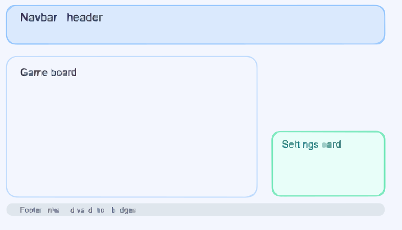

# Click Speed Challenge

Date: 2026

## Objective
Click the active target tile as quickly as possible before the timer reaches zero.

## Rules
- Enter your player name and select a difficulty.
- Click **Play** to begin the round.
- Click the active target tile to score points.
- The active tile moves randomly after each hit.
- Your high score is saved in local storage.

## Tech Used
- HTML5 semantic markup
- CSS3 custom properties and responsive layout
- Bootstrap 5 components: Navbar, Cards, Modal, Progress bar
- JavaScript ES modules and DOM templating
- localStorage persistence

## Resources
- Bootstrap 5: https://getbootstrap.com/docs/5.3/getting-started/introduction/
- Google Fonts: https://fonts.google.com/specimen/Orbitron
- HTML Validator: https://validator.w3.org/nu/
- WAVE Accessibility: https://wave.webaim.org/

## Demo Links
- Deployed game: https://cmiller288.github.io/something-game/
- GitHub repo:  https://github.com/Cmiller288

## Wireframe


## Code Example
```javascript
const boardData = Array.from({ length: 9 }, (_, index) => ({
  id: index + 1,
  label: `Target ${index + 1}`
}));

function renderBoard() {
  boardEl.innerHTML = '';
  boardData.forEach((cell) => {
    const button = document.createElement('button');
    button.type = 'button';
    button.className = 'board-button';
    button.dataset.cellId = cell.id;
    button.textContent = cell.label;
    button.setAttribute('aria-pressed', 'false');
    button.addEventListener('click', handleBoardClick);

    const wrapper = document.createElement('div');
    wrapper.className = 'board-cell';
    wrapper.appendChild(button);
    boardEl.appendChild(wrapper);
  });
}
```

### Code Explanation
This snippet uses a data-driven array to render the game board. Each object in `boardData` becomes a clickable tile. When the board is re-rendered on game start, the UI is rebuilt from the array so the game state is managed in JavaScript rather than hard-coded HTML.

## Accessibility
- `aria-live="polite"` provides screen reader updates for score and timer changes.
- Keyboard focus states are visible.
- Form fields provide inline validation messages.
- Color contrast is maintained for accessibility.

## Footer Validation Links
- Nu Validator: https://validator.w3.org/nu/?doc=https://cmiller288.github.io/something-game
- WAVE Report: https://wave.webaim.org/report#/https://cmiller288.github.io/something-game
